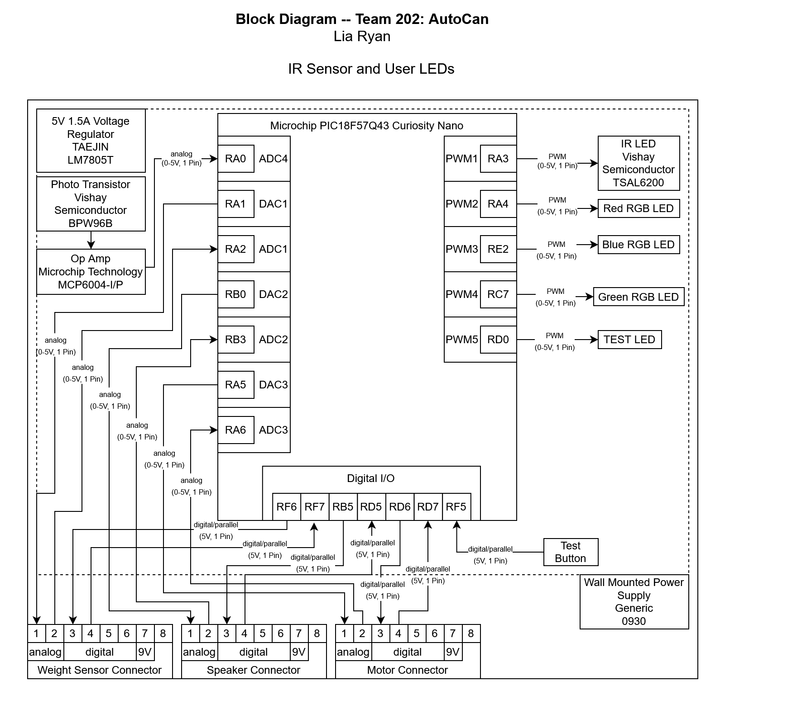

## Overview
This block diagram uses an IR LED, OP-amp, and Phototransistor to create an IR sensor. This IR sensor will detect when a user wishes to open the trash can. When the Curiosity Nano detects this input from the sensor, it will then send an opening digital signal to the motor subsystem through the communication connector to open the lid.

Along with the exterior IR sensor, this subsystem also controls an RGB light that will inform the user of amount of trash in the trash can. If the Curiosity Nano receives a full signal from the weight sensor or the interior IR sensor through the communication connector, the front LED will start blinking red, informing the user to replace or compact the trash.

The power source for this subsystem will be a 9V power supply from a wall connected barrel-jack, or a 9V and 5V transfer from another subsystem through the communication connectors.

## External IR Sensor and User Interface Lights Block Diagram
Here is the block diagram for Lia Ryan's Subsystem.

{style width:"350" height:"300;"}
