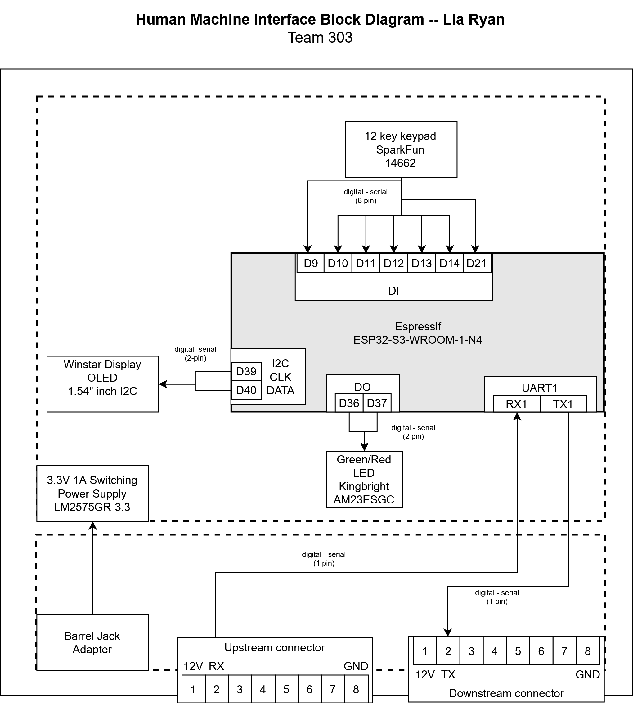

## Overview
This is the block diagram for the Human Design Interface subsystem for Exploration drone project. 

The Human Design Interface (HDI) requires several parts in order to function within our device's requirements and the requirements of our class. The block diagram parts to fulfill these requirements follow.  

* UART upstream and downstream header  
&nbsp;&nbsp;&nbsp;&nbsp; These headers are to communicate with the rest of the device's subsystems in a loop 
* OLED Screen 
&nbsp;&nbsp;&nbsp;&nbsp; To display data, control, and alter the other subsystems 
* Snap programmer 
&nbsp;&nbsp;&nbsp;&nbsp; Allows PIC to be reprogrammed 
* Keypad 
&nbsp;&nbsp;&nbsp;&nbsp; User input for controlling device and reading outputs 
* Power Supply 
&nbsp;&nbsp;&nbsp;&nbsp; Powers the subsystem(s) 
* LEDs 
&nbsp;&nbsp;&nbsp;&nbsp; For debugging and any other purpose that we may want them to do 

## Decision Making Process

In order to develop this Block Diagram, I used information from the datasheets of the ESP32, Keypad, LED, and OLED display. This information showed me that connecting these components to these pins will allow my subsystem to function.

## Block Diagram 
The Human Design Interface Block Diagram that I made.

