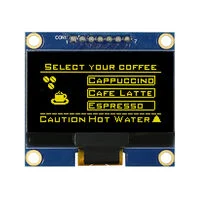
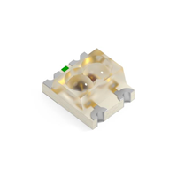

## Human Design Interface Selected Major Components

The following sections are the selected major components necessary for the Human Design Interface.

### OLED Screen

| **Solution**                                                                                                                                                                                    | **Pros**                                                                                                                                    | **Cons**                                                                                            |
| ------------------------------------------------------------------------------------------------------------------------------------------------------------------------------------------------- | ------------------------------------------------------------------------------------------------------------------------------------------- | --------------------------------------------------------------------------------------------------- |
|  Option 1.  Winstar Display WEA012864DWPP3N00003 0.96” white graphic display $7.35/each [link to product](https://www.digikey.com/en/products/detail/winstar-display/WEA012864DWPP3N00003/20533255)                 | \* Experience using in class lab \* Less pins to worry about \* Less expensive                                                       | \* Smaller display size \* Difficult to view                                                   |
|  **Option 2**.   Winstar Display WEA012864ALAP3N00E00  1.54” yellow graphic display $14.78/each [link to product](https://www.digikey.com/en/products/detail/winstar-display/WEA012864ALAP3N00E00/24883012) | \* Similar interface as OLED used in class \* Larger Screen \* Easier to view \* Yellow color could look more unique            | \* More pins to worry about \* More expensive                                                    |

**Choice:** Option 2: Winstar Display WEA012864ALAP3N00E00 1.54” yellow graphic display

**Rationale:** The main reason I chose this display is because it is larger than the one supplied to us in class. This will make it easier for us to see that data and words that are to be displayed on it. Also, this display uses the same I2C interface as the smaller one meaning that the programming of it should be on the same difficulty as the one supplied in class. However, there are more pins on this display, but they seem to be optional pins that allow for extra customization. The yellow color of the OLED could also help set us apart from our competitors.

### Keypad

| **Solution**                                                                                                                                                                                    | **Pros**                                                                                                                                    | **Cons**                                                                                            |
| ------------------------------------------------------------------------------------------------------------------------------------------------------------------------------------------------- | ------------------------------------------------------------------------------------------------------------------------------------------- | --------------------------------------------------------------------------------------------------- |
|  Option 1.  Knitter Switch YFT KNI 12B 19 Membrane Keypad $14.44/each [link to product](https://www.digikey.com/en/products/detail/knitter-switch/YFT-KNI-12B-19/15296291)                 | \* Slim and light \* Easy to stick anywhere                                                                                             | \* Button feel may be lacking \* More expensive \* Harder to connect to the header            |
|  **Option 2**.   SparkFun Electronics 14662 Switch Keypad $4.95/each [link to product](https://www.digikey.com/en/products/detail/sparkfun-electronics/14662/8702491) | \* Less expensive \* Holes to screw onto desired position \* Easier to connect a pin header                                         | \* May be bulky for our device \* Less detailed datasheet                                      |

**Choice:** Option 2

**Rationale:** I chose option 2 due to the much lower price when compared to option 1; having tactile feedback in comparison to option 1; and having an easier connector to hook up to a header to go to the PCB board as compared to option 1.

### LEDs

| **Solution**                                                                                                                                                                                    | **Pros**                                                                                                                                    | **Cons**                                                                                            |
| ------------------------------------------------------------------------------------------------------------------------------------------------------------------------------------------------- | ------------------------------------------------------------------------------------------------------------------------------------------- | --------------------------------------------------------------------------------------------------- |
|  **Option 1**.  Kingbright AM23ESGC Green/Red LED $0.48/each [link to product](https://www.digikey.com/en/products/detail/kingbright/AM23ESGC/3084776)                 | \* Pin layout is easier to solder \* Cheaper in bulk \* Wider viewing angle \* Uses less power \* Smaller size                   | N/A                                                                                                |
|  Option 2.   SunLED XZMDKVG57W-1 Green/Red LED $0.48/each [link to product](https://www.digikey.com/en/products/detail/sunled/XZMDKVG57W-1/13559285) | N/A                                                                                                                                        | \* Larger size \* Pin layout is more difficult to solder \* More expensive in bulk \* Smaller viewing angle \* Uses more power |

**Choice:** Option 1

**Rationale:** I chose option 1 because the layout of the LED looks like it would be much easier to solder onto a PCB than that of option 2. Also, the viewing angle is much greater, which would make it easier to see the light when debugging.

### Power Management

-----------
