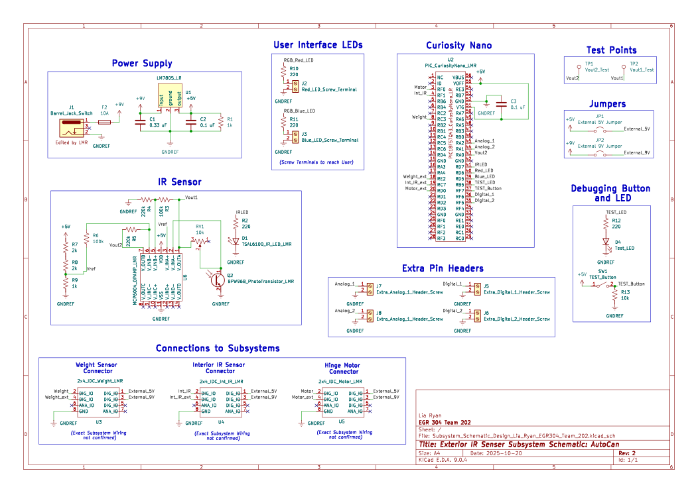

## Overview

This schematic is primarily designed to support the external IR sensor of the AutoCan. This sensor will detect when a user wishes to open the trash can and send a signal to the motor subsystem to open. This schematic also has front facing LEDs to inform the user if the level or weight of the trash inside reachces a critical amount and requires taking out.

{style width:"350" height:"300;"}
**Figure 01:** Showing Lia Ryan's Exterior IR sensor Schematic.

## Resouces

The schematic as a PDF download is available [*here*](10-17-schem-Lia-Ryan.pdf), and the Zip folder of the project [*here*](10-27-25-subsystem-archive-Lia-Ryan.zip).