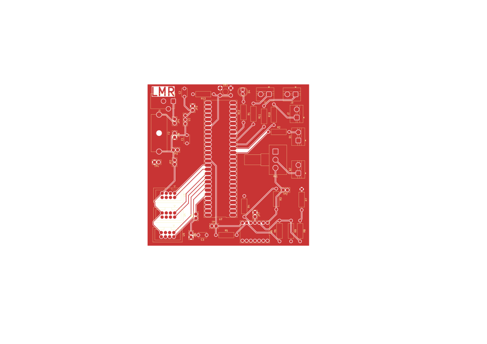
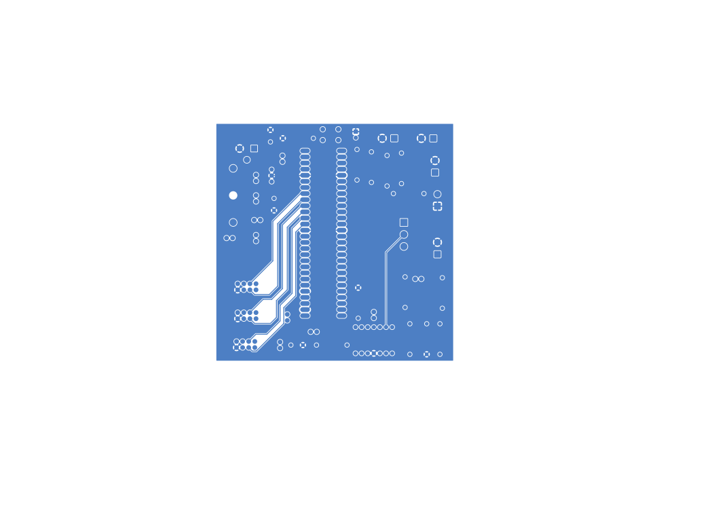

## Overview

This is the front and back of my PCB design without the drill holes. Both show the copper that will remain after milling. However, the front also shows the Top silkscreen. Using jumpers, this PCB is modular and somewhat reconfigurable in the case that mistakes were make during design.

{style width:"350" height:"300;"}
**Figure 01:** Showing Lia Ryan's Front PCB Design.

{style width:"350" height:"300;"}
**Figure 02:** Showing Lia Ryan's Back PCB Design.

## Resouces

The Front PCB design as a PDF download is available [*here*](11-7-25-PCB-Front.pdf).  
The Front PCB design as a PDF download is available [*here*](11-7-25-PCB-Back.pdf).  
The Zip folder of the project is available [*here*](11-7-25-schematic.zip). 
The Zip folder of the Gerber and drill files are [*here*](LiaRyan202.zip). 