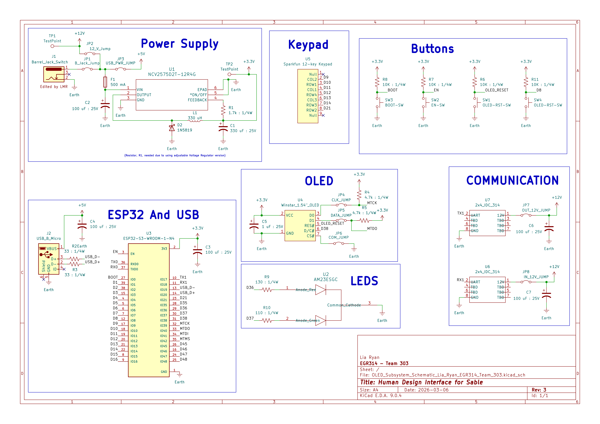

## Overview

This schematic, shown in Figure 1, is design to support human interfacing with Sable. Using a keypad and OLED screen. This subsystem allows the user to read data coming in from all the other subsystems while also being able to control any adjustable parameters that the other subsystems may have. 

The user input will be taken in through a 12-key keypad. With so many buttons, this keypad will able to adapt to whatever type of control or adjustment is required of each subsystem. The OLED screen will be used to display data being sent from each subsystem and any variables that can be adjusted. Subsystem information will be cycled on the OLED screen using a button on the keypad.

{style width:"350" height:"300;"}
**Figure 1:** Showing my Human Design Interface subsystem for Sable.

## Resources

The schematic as a PDF download is available [*here*](HDI_PIC2.pdf), and the Zip folder of the project [*here*](OLED_Subsystem_Schematic_Lia_Ryan_EGR314_Team_303.zip).