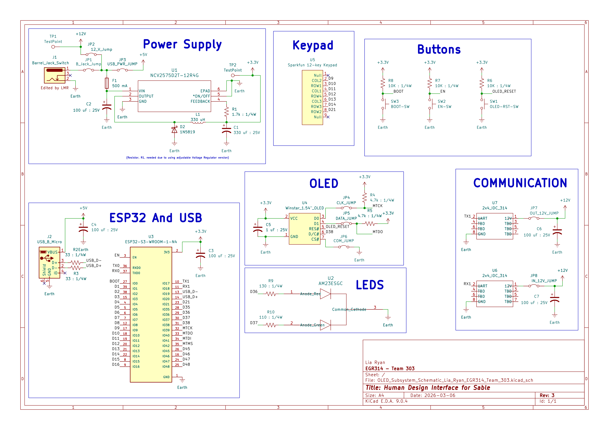

## Overview

This schematic, shown in Figure 1, is design to support human interfacing with Sable. Using a keypad and OLED screen. This subsystem allows the user to read data coming in from all the other subsystems while also being able to control any adjustable parameters that the other subsystems may have. 

{style width:"350" height:"300;"}
**Figure 1:** Showing my Human Design Interface subsystem for Sable.

## Resources

The schematic as a PDF download is available [*here*](HDI_PIC.pdf), and the Zip folder of the project [*here*](dummyZip.zip).