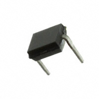
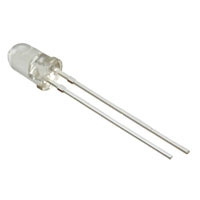

## IR Sensor

Solution | Pros | Cons
---------|------|------
  Option 1  Vishay BPW34 Through Hole Photo Transistor  $1.23 each  [link](https://www.digikey.com/en/products/detail/vishay-semiconductor-opto-division/BPW34/1681149) | * Small Size   * More precise distance  | * More expensive   * Higher viewing angle

Solution | Pros | Cons
---------|------|------
  *Option 2   *Vishay BPW96B Through Hole Photo Transistor   *$0.95 each   [link](https://www.digikey.com/en/products/detail/vishay-semiconductor-opto-division/BPW96B/4071185?s=N4IgTCBcDaIEIAUDqBOAbHEBdAvkA) | *Less expensive   *Lower Viewing angle | *Less precise distance   *Large size

| Solution | Pros | Cons |
|-----------|------|------|
  Option 3  TT Electronics OPB732 Through Hole IR LED   $4.61 each  [link](https://www.digikey.com/en/products/detail/tt-electronics-optek-technology/OPB732/1637069) | • Currently have 1 device • Setup is known | • Short viewing distance • More expensive |

**Choice:** Option 2: Vishay BPW96B Through Hole Photo Transistor

**Rationale:** For our products operation we don’t need a precise distance calculation. As long as the IR sensor can detect an object within a set range, the product’s operation can be activated. Also, option 2 will be able to pick up the signals we want without interference due to its lower viewing angle. Option 2 is less expensive than the other choices, allowing our customers to pay less for the finished device.
