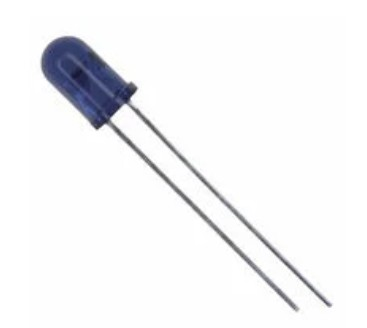

# IR Sensor
## Photo Transistor
| Solution | Pros | Cons |
|-----------|------|------|
  Option 1  Vishay BPW34 Through Hole Photo Transistor  $1.23 each  [link](https://www.digikey.com/en/products/detail/vishay-semiconductor-opto-division/BPW34/1681149) | * Small Size   * More precise distance  | * More expensive   * Higher viewing angle

| Solution | Pros | Cons |
|-----------|------|------|v
  *Option 2   *Vishay BPW96B Through Hole Photo Transistor   *$0.95 each   [link](https://www.digikey.com/en/products/detail/vishay-semiconductor-opto-division/BPW96B/4071185?s=N4IgTCBcDaIEIAUDqBOAbHEBdAvkA) | *Less expensive   *Lower Viewing angle | *Less precise distance   *Large size

| Solution | Pros | Cons |
|-----------|------|------|
  Option 3  TT Electronics OPB732 Through Hole IR LED   $4.61 each  [link](https://www.digikey.com/en/products/detail/tt-electronics-optek-technology/OPB732/1637069) | • Currently have 1 device • Setup is known | • Short viewing distance • More expensive |

**Choice:** Option 2: Vishay BPW96B Through Hole Photo Transistor

**Rationale:** For our products operation we don’t need a precise distance calculation. As long as the IR sensor can detect an object within a set range, the product’s operation can be activated. Also, option 2 will be able to pick up the signals we want without interference due to its lower viewing angle. Option 2 is less expensive than the other choices, allowing our customers to pay less for the finished device.

## IR LED
| Solution | Pros | Cons |
|-----------|------|------|
  Option 1 TSAL6100 Through Hole IR LED $0.49 each [link](https://www.digikey.com/en/products/detail/vishay-semiconductor-opto-division/TSAL6100/1681338) | • High radiant intensity • Lower viewing angle | • Need to construct housing • Need to create an attachment to PIC |

| Solution | Pros | Cons |
|-----------|------|------|
  Option 2  TSAL6200 Through Hole IR LED $0.49 each  [link](https://www.digikey.com/en/products/detail/vishay-semiconductor-opto-division/TSAL6200/1681339?s=N4IgTCBcDaICoGUCCAZAbGADJkBdAvkA) | • Higher stock • Stable over operating temperature | • Higher viewing angle • Lower radiant intensity • Need to construct housing • Need to create an attachment to PIC |

| Solution | Pros | Cons |
|-----------|------|------|
  Option 3 TT Electronics OPB732 Through Hole IR LED $4.61 each [link](https://www.digikey.com/en/products/detail/tt-electronics-optek-technology/OPB732/1637069) | • Currently have 1 device • Setup is known | • Short viewing distance • Expensive |

**Choice:** Option 1: TSAL6100 Through Hole IR LED

**Rationale:** This LED Is easier to work with and should give more exact results than the other options. The product shouldn’t be triggered automatically; with the narrow viewing angle of this LED, only a small area will be the trigger area compared to the TSAL6200. Also, the range of this LED is far greater than the OPB732, making operation of the product easier for the end user.
