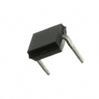
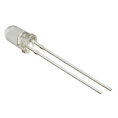
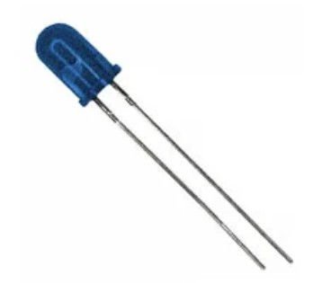
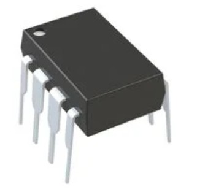
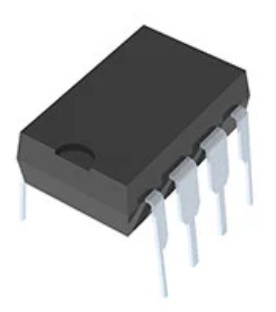
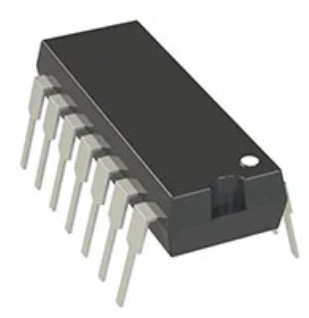
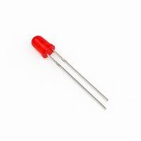
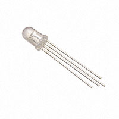
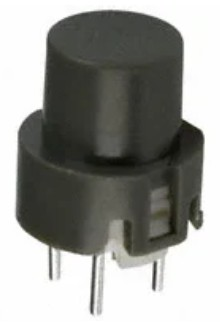
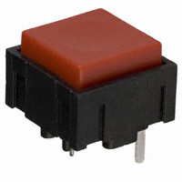

## IR Sensor

#### Photo Transistor
| Solution | Pros | Cons |
|-----------|------|------|
  Option 1  Vishay BPW34 Through Hole Photo Transistor  $1.23 each  [link](https://www.digikey.com/en/products/detail/vishay-semiconductor-opto-division/BPW34/1681149) | * Small Size   * More precise distance  | * More expensive   * Higher viewing angle

| Solution | Pros | Cons |
|-----------|------|------|
  *Option 2   *Vishay BPW96B Through Hole Photo Transistor   *$0.95 each   [link](https://www.digikey.com/en/products/detail/vishay-semiconductor-opto-division/BPW96B/4071185?s=N4IgTCBcDaIEIAUDqBOAbHEBdAvkA) | *Less expensive   *Lower Viewing angle | *Less precise distance   *Large size

| Solution | Pros | Cons |
|-----------|------|------|
  Option 3  TT Electronics OPB732 Through Hole IR LED   $4.61 each  [link](https://www.digikey.com/en/products/detail/tt-electronics-optek-technology/OPB732/1637069) | • Currently have 1 device • Setup is known | • Short viewing distance • More expensive |

**Choice:** Option 2: Vishay BPW96B Through Hole Photo Transistor

**Rationale:** For our products operation we don’t need a precise distance calculation. As long as the IR sensor can detect an object within a set range, the product’s operation can be activated. Also, option 2 will be able to pick up the signals we want without interference due to its lower viewing angle. Option 2 is less expensive than the other choices, allowing our customers to pay less for the finished device.

#### IR LED
| Solution | Pros | Cons |
|-----------|------|------|
  Option 1 TSAL6100 Through Hole IR LED $0.49 each [link](https://www.digikey.com/en/products/detail/vishay-semiconductor-opto-division/TSAL6100/1681338) | • High radiant intensity • Lower viewing angle | • Need to construct housing • Need to create an attachment to PIC |

| Solution | Pros | Cons |
|-----------|------|------|
  Option 2  TSAL6200 Through Hole IR LED $0.49 each  [link](https://www.digikey.com/en/products/detail/vishay-semiconductor-opto-division/TSAL6200/1681339?s=N4IgTCBcDaICoGUCCAZAbGADJkBdAvkA) | • Higher stock • Stable over operating temperature | • Higher viewing angle • Lower radiant intensity • Need to construct housing • Need to create an attachment to PIC |

| Solution | Pros | Cons |
|-----------|------|------|
  Option 3 TT Electronics OPB732 Through Hole IR LED $4.61 each [link](https://www.digikey.com/en/products/detail/tt-electronics-optek-technology/OPB732/1637069) | • Currently have 1 device • Setup is known | • Short viewing distance • Expensive |

**Choice:** Option 1: TSAL6100 Through Hole IR LED

**Rationale:** This LED Is easier to work with and should give more exact results than the other options. The product shouldn’t be triggered automatically; with the narrow viewing angle of this LED, only a small area will be the trigger area compared to the TSAL6200. Also, the range of this LED is far greater than the OPB732, making operation of the product easier for the end user.

#### Op Amp for Photo Transistor

| Solution | Pros | Cons |
|-----------|------|------|
  Option 1 Microchip MCP6022-I/P Through Hole Op Amp $1.86 each [link](https://www.digikey.com/en/products/detail/microchip-technology/MCP6022-I-P/417828) | • High frequency gain bandwidth • Has the number of circuits needed | • Higher price • Slow shipping speed |

| Solution | Pros | Cons |
|-----------|------|------|
  Option 2 Analog Devices OP295GPZ Through Hole Op Amp $12.82 each [link](https://www.digikey.com/en/products/detail/analog-devices-inc/OP295GPZ/820348) | • Has the number of circuits needed • Smaller size | • Higher price • Lower frequency gain bandwidth |

| Solution | Pros | Cons |
|-----------|------|------|
  Option 3 Microchip MCP6004-I/P Through Hole Op Amp $0.59 each [link](https://www.digikey.com/en/products/detail/microchip-technology/MCP6004-I-P/523060?s=N4IgTCBcDaILIGEAKA2ADGgLAWgJIHokQBdAXyA) | • Lower price • Currently have 1 device | • Lower frequency gain bandwidth • Has more circuits than necessary |

**Choice:** Option 3 Microchip MCP6004-I/P Through hole Op Amp

**Rationale:** The MCP6004-I/P is easier to work with because we have worked with in the past and know the general setup that is required to make it function. Making our product more affordable for the customer, the op-amp is significantly less expensive than the competitors and will be able to complete its task. 

## LED

#### Red LED

| Solution | Pros | Cons |
|-----------|------|------|
  Option 1 Lumimax LEDDC-5RED Through Hole LED $0.08 each [link](https://www.digikey.com/en/products/detail/lumimax-optoelectronic-technology/LEDDC-5RED/26680666) | • Less expensive • Less pins • Only one color | • Clear |

| Solution | Pros | Cons |
|-----------|------|------|
  Option 2 QTB QBL8RGB60D0-2897 Through Hole LED $1.06 each [link](https://www.digikey.com/en/products/detail/qt-brightek-qtb/QBL8RGB60D0-2897/10441184) | • Multiple colors • Diffused | • More expensive • More complicated to code |

| Solution | Pros | Cons |
|-----------|------|------|
  Option 3 QTB QBL8RGB25C0 Through Hole LED $1.16 each [link](https://www.digikey.com/en/products/detail/qt-brightek-qtb/QBL8RGB25C0/10441180) | • Multiple colors • Only takes a single LED housing instead of 2 | • More expensive • Clear |

**Choice:** Option 2: QTB QBL8RGB60D0-2897 Through Hole LED

**Rationale:** An RGB LED will only take up on spot on the product making it look nicer than if it were two separate LEDS of differing colors. The diffused housing of option 2 hides the electronics inside the LED housing making the product more visually appealing.

#### Blue LED
Using RGB LED

## Button

#### Button 1

| Solution | Pros | Cons |
|-----------|------|------|
  Option 1 Diptronics 113-DTS-62N-V Through Hole Tactile Switch $0.23 each [link](https://www.mouser.com/ProductDetail/Diptronics/DTS-62N-V?qs=gTYE2QTfZfSKTB5KYn%252Brkw%3D%3D) | • Less expensive • Currently have product | • Small size • Not visually appealing |

| Solution | Pros | Cons |
|-----------|------|------|
  Option 2 C&K D6R10 F2 LFS Through Hole Pushbutton Switch $1.62 each [link](https://www.digikey.com/en/products/detail/c-k/D6R10-F2-LFS/1466347) | • Easy-to-push size • Simple pin layout | • More expensive • Very long lead time |

| Solution | Pros | Cons |
|-----------|------|------|
  Option 3 C&K KS11R23CQD Through Hole Pushbutton Switch $2.84 each [link](https://www.digikey.com/en/products/detail/c-k/KS11R23CQD/332672) | • Easy-to-push size • Eye-catching color | • More expensive • Odd pin layout |

**Choice:** Option 3: C&K KS11R23CQD Trough hole switch pushbutton

**Rationale:** Option 3 was chosen due to the eye catching color and indented contact point, indicating it is a button. Although the cost is higher and the layout is more complicated than the other options, this switch has a shorter lead time than option 2 and is easier to press than option 1.
