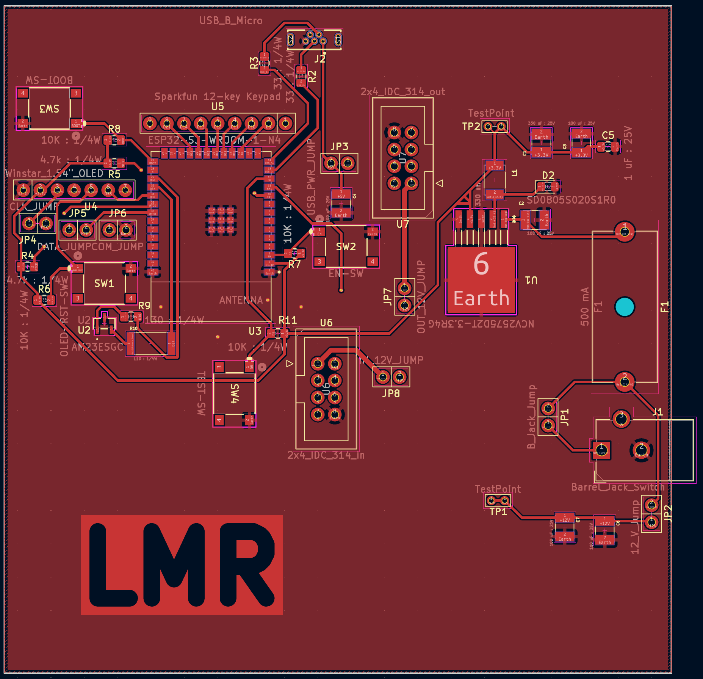
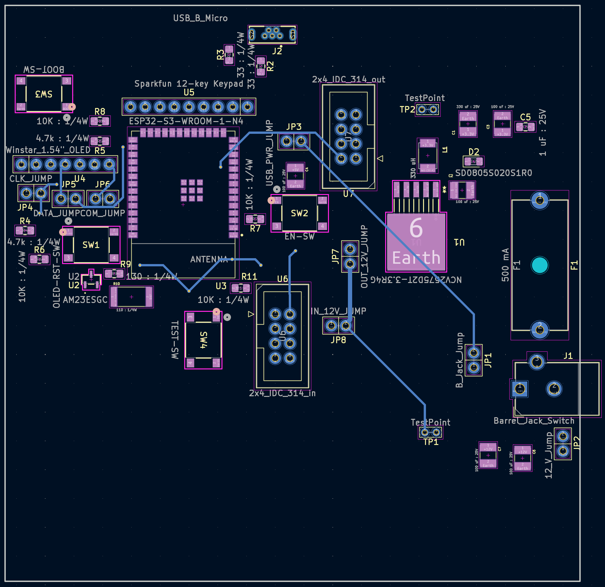

## PCB

This section shows the PCB design, the unpopulated physical PCB, and the populated physical PCB.

### PCB Design
Here is the front and back of my PCB Design

### Unpopulated PCB
Here is the front and back of my printed PCBs

### Populated PCB
Here is a pic of my populated PCB

## PCB
The schematic as a PDF download is available [*here*](HDI_PIC2.pdf), and the Zip folder of the project [*here*](OLED_Subsystem_Schematic_Lia_Ryan_EGR314_Team_303.zip).